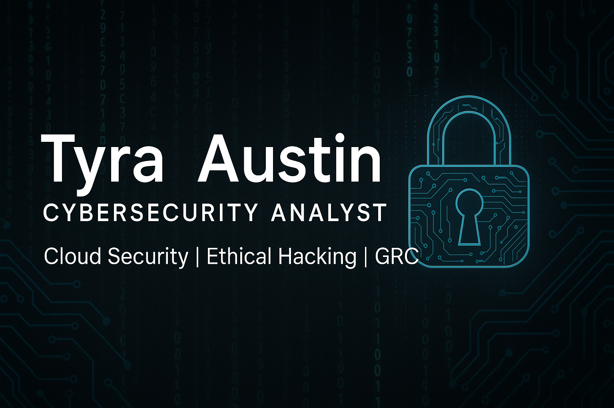

# 👩🏽‍💻 Tyra Austin – Cybersecurity Portfolio

Welcome to my cybersecurity portfolio! I'm a Master's student at Western Governors University, passionate about cloud security, incident response, and ethical hacking. Below are selected hands-on projects, professional labs, and real-world exercises I’ve completed through academic and personal development.

---

## 🔐 Featured Projects

### [☁️ Cloud Security Capstone – SWBTL LLC](https://github.com/SeelineSiren12/Cloud-Security-Capstone)
- Built a secure Azure IaaS environment for a fictional federal contractor
- Implemented RBAC, Key Vault encryption, and automated backups
- Mapped controls to FISMA, PCI DSS, and NIST SP 800-53
- 📄 Includes full documentation and step-by-step screenshots

---

### 🛡️ Penetration Testing Report – Western View Hospital
- Performed penetration test assessment on a hospital's IT infrastructure
- Evaluated HIPAA compliance and tested vulnerabilities in patient record systems
- Aligned findings with NIST SP 800-115 and OWASP Testing Guide
- ✅ Recommended user behavior analytics, phishing simulations, and EHR hardening
-📄 [Penetration Testing Report – PDF](D484_PenetrationTestReportbyTyra_Austin.pdf)

---

### 🧯 Incident Response Report – Malware Outbreak
- Investigated a real-world crypto-mining malware attack (XMRig)
- Analyzed system and network impact, restored service, and hardened firewall rules
- Recommended long-term prevention via HIDS/IPS, phishing training, and segmentation
- 📄 [Incident Response Report – PDF](Incident_Reporting_Project_TAustin.pdf)

---

## 🧪 Home Lab Practice

Built and maintained a personal cybersecurity lab using Oracle VirtualBox with Kali Linux and penetration testing tools.

**Tools Used:**
- 🖥️ Kali Linux, Oracle VirtualBox
- 🧪 Nmap, Burp Suite, Wireshark, Metasploit

**Practice Areas:**
- Network scanning and port discovery with Nmap  
- Web application testing with Burp Suite  
- Packet sniffing and protocol analysis with Wireshark  
- Exploit simulation using Metasploit

📸 *Screenshots coming soon as I document and publish walkthroughs.*

---

## 🛠️ Skills & Technologies

- Microsoft Azure (Key Vault, IAM, Backup Vault)
- Role-Based Access Control (RBAC), CMK Encryption
- Network Security Tools: Nmap, Wireshark, Burp Suite, Metasploit
- HIPAA, NIST SP 800-53, PCI DSS, OWASP Testing Guide
- Incident Response & Technical Documentation
- GitHub, Markdown, VirtualBox, Kali Linux

---

## 📫 Connect With Me

- 🌐 LinkedIn: linkedin.com/in/tyra-austin
- 📄 Download Resume (PDF)](TyraAustin_Cybersecurity_Resume.pdf)
- 💌 Email: tyraaustin57@gmail.com
